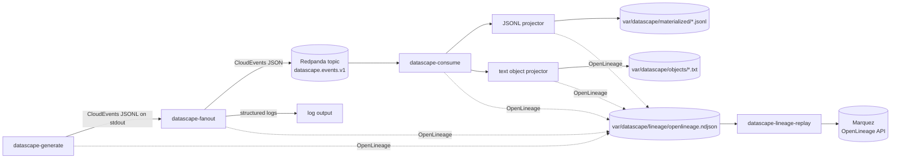

# Datascape Lakehouse PoC

Datascape Lakehouse PoC is a Go proof-of-concept for deterministic CloudEvents generation, Redpanda fan-out, bounded event consumption, local materialization, text object projection, and local OpenLineage tracking.

The project is intentionally incremental. It currently uses local JSONL tables and local text files as replaceable stand-ins for later storage systems. Audit, PDF generation, Marquez, MinIO/S3, Iceberg, and PostgreSQL are not required for this increment.

## Architecture



CloudEvents are business/domain events. OpenLineage events are separate operational metadata about jobs, runs, inputs, and outputs. The code does not mutate CloudEvents with lineage fields.

Stable lineage path:

```text
datascape-generate
  -> datascape-generate/stdout/events
  -> datascape-fanout
  -> redpanda://localhost:19092/datascape.events.v1
  -> datascape-consume
  -> file://var/datascape/materialized/tables/
  -> file://var/datascape/objects/documents/
```

## Runtime Flow

`datascape-generate`:

- selects a registered generator by name;
- streams domain-neutral facts through Go channels;
- maps facts to `github.com/cloudevents/sdk-go/v2.Event`;
- writes CloudEvents JSONL to stdout;
- emits OpenLineage START/COMPLETE/FAIL metadata when configured.

`datascape-fanout`:

- reads CloudEvents JSONL from stdin;
- opens configured output adapters;
- gives each output adapter its own bounded worker goroutine;
- batches events for adapters that implement `BatchPublisher`;
- publishes to Redpanda, logs, stdout, or discard adapters;
- emits OpenLineage metadata for stdin input and configured outputs.

`datascape-consume`:

- consumes CloudEvents from Redpanda through a generic event source port;
- supports bounded consumption for demos through max event limits;
- dispatches events or batches to configured handler/projector adapters;
- materializes JSONL tables and text object artifacts;
- emits OpenLineage metadata for the consumer and projector steps.

`datascape-lineage-replay`:

- reads persisted OpenLineage NDJSON;
- emits each event to a configured lineage transport;
- is intended for replaying local lineage into Marquez without re-running the CloudEvents pipeline.

## Repository Layout

- `cmd/datascape-generate`: generator CLI composition.
- `cmd/datascape-fanout`: fan-out CLI composition.
- `cmd/datascape-consume`: consumer CLI composition.
- `internal/app/generate`: generation orchestration.
- `internal/app/fanout`: fan-out orchestration, batching, workers, publisher lifecycle.
- `internal/app/consume`: bounded consumption and handler dispatch.
- `internal/contracts/event`: facts, CloudEvents factory, JSONL codec, summaries.
- `internal/ports/generator`: generator interfaces.
- `internal/ports/fanout`: publisher interfaces.
- `internal/ports/consume`: event source and handler/projector interfaces.
- `internal/adapters/generator`: generator registry and demo school generator.
- `internal/adapters/fanout`: log, stdout, discard, and Redpanda publishers.
- `internal/adapters/consume`: handler registry, Redpanda source, JSONL projector, text object projector.
- `internal/lineage`: local OpenLineage-compatible events and emitters.
- `internal/adapters/lineage`: lineage emitter factory, Marquez HTTP emitter, NDJSON reader adapter.
- `contracts`: schema and standards contracts.
- `docs/architecture/adr`: architecture decision records.
- `docs/standards/standards-register.md`: standards boundary register.
- `scripts`: demo automation used by `just`.

## Requirements

- Go 1.23 or newer.
- `just` for recipe shortcuts.
- Docker Compose for Redpanda-backed demos.

Unit tests do not require Docker, Redpanda, network services, Marquez, MinIO, or PostgreSQL.

## Quick Start

Fetch dependencies:

```bash
go mod download
go mod tidy
```

Run unit tests:

```bash
go test ./...
```

Generate CloudEvents only:

```bash
go run ./cmd/datascape-generate --generator demo.school.v1
```

Run the local log-only pipeline:

```bash
just run-demo
```

Run the Redpanda fan-out demo:

```bash
just up
just create-redpanda-topic
just run-redpanda-demo
```

Run the full lineage and materialization demo:

```bash
just run-lineage-demo
```

Run the full demo and replay OpenLineage into Marquez:

```bash
just run-marquez-demo
```

The lineage demo:

- starts Redpanda and Redpanda Console;
- waits for Redpanda using `rpk cluster health -X brokers=localhost:9092 | grep -E 'Healthy:.+true' || exit 1`;
- creates `datascape.events.v1` if missing;
- generates deterministic CloudEvents;
- fans out to Redpanda and logs;
- consumes a bounded event set;
- writes JSONL tables to `var/datascape/materialized`;
- writes text artifacts to `var/datascape/objects`;
- writes OpenLineage NDJSON to `var/datascape/lineage/openlineage.ndjson`;
- exits cleanly.

## Commands

```bash
just test
just deps
just up
just create-redpanda-topic
just generate
just fanout-log
just fanout-redpanda
just run-demo
just run-redpanda-demo
just run-materialize-demo
just run-lineage-demo
just run-marquez-demo
just consume-redpanda
just down
```

Direct examples:

```bash
go run ./cmd/datascape-generate --generator demo.school.v1 \
  | go run ./cmd/datascape-fanout --outputs log
```

```bash
DATASCAPE_REDPANDA_BROKERS=localhost:19092 \
DATASCAPE_REDPANDA_TOPIC=datascape.events.v1 \
DATASCAPE_OUTPUTS=redpanda,log \
go run ./cmd/datascape-generate --generator demo.school.v1 \
  | go run ./cmd/datascape-fanout --outputs redpanda,log
```

```bash
DATASCAPE_REDPANDA_BROKERS=localhost:19092 \
DATASCAPE_REDPANDA_TOPIC=datascape.events.v1 \
DATASCAPE_REDPANDA_CONSUMER_GROUP=datascape-consume-demo \
DATASCAPE_CONSUME_HANDLERS=jsonl,objects \
DATASCAPE_CONSUME_MAX_EVENTS=102 \
go run ./cmd/datascape-consume
```

## Configuration

Generator:

```text
DATASCAPE_GENERATOR=demo.school.v1
DATASCAPE_RUN_ID=run-...
DATASCAPE_SEED=42
DATASCAPE_EVENT_SOURCE=urn:datascape:generate
```

Fan-out:

```text
DATASCAPE_OUTPUTS=redpanda,log
DATASCAPE_FANOUT_BATCH_SIZE=100
```

Redpanda publisher and consumer:

```text
DATASCAPE_REDPANDA_BROKERS=localhost:19092
DATASCAPE_REDPANDA_TOPIC=datascape.events.v1
DATASCAPE_REDPANDA_TOPIC_MODE=single
DATASCAPE_REDPANDA_BATCH_SIZE=100
DATASCAPE_REDPANDA_CONSUMER_GROUP=datascape-consume-demo
DATASCAPE_REDPANDA_CONSUMER_START_OFFSET=first
```

Consumer and projectors:

```text
DATASCAPE_CONSUME_SOURCE=redpanda
DATASCAPE_CONSUME_HANDLERS=jsonl,objects
DATASCAPE_CONSUME_BATCH_SIZE=100
DATASCAPE_CONSUME_MAX_EVENTS=102
DATASCAPE_JSONL_DIR=var/datascape/materialized
DATASCAPE_OBJECT_DIR=var/datascape/objects
```

Lineage:

```text
DATASCAPE_LINEAGE_OUTPUT=noop
DATASCAPE_LINEAGE_OUTPUT=file
DATASCAPE_LINEAGE_OUTPUT=marquez
DATASCAPE_LINEAGE_FILE=var/datascape/lineage/openlineage.ndjson
DATASCAPE_LINEAGE_NAMESPACE=datascape
DATASCAPE_LINEAGE_PRODUCER=github.com/datascape/lakehouse-poc
DATASCAPE_LINEAGE_SCHEMA_URL=https://openlineage.io/spec/1-0-5/OpenLineage.json
DATASCAPE_LINEAGE_REPLAY_LIMIT=0
DATASCAPE_MARQUEZ_URL=http://localhost:5000
DATASCAPE_MARQUEZ_TIMEOUT=10s
```

`DATASCAPE_LINEAGE_OUTPUT=noop` is the default. Use `file` for local demo lineage output and `marquez` to post OpenLineage events to Marquez at `/api/v1/lineage`.

Replay existing local lineage into Marquez:

```bash
DATASCAPE_LINEAGE_OUTPUT=marquez \
DATASCAPE_MARQUEZ_URL=http://localhost:5000 \
go run ./cmd/datascape-lineage-replay --file var/datascape/lineage/openlineage.ndjson
```

## Materialized Outputs

The JSONL projector writes simple local tables:

- `schools.jsonl`
- `classes.jsonl`
- `students.jsonl`
- `attendance.jsonl`
- `grades.jsonl`
- `documents.jsonl`

The text object projector writes `.txt` artifacts for `document.uploaded.v1`. It does not generate PDFs. The local file boundary is intentionally replaceable by MinIO/S3 later.

## Testing

Run:

```bash
go test ./...
```

Tests use fake sources, publishers, handlers, stores, and lineage emitters. Filesystem tests use `t.TempDir()` where needed. Default tests must not require Redpanda, Docker, network services, Marquez, MinIO, PostgreSQL, or Iceberg.

## Design Rules

- CloudEvents are domain events.
- OpenLineage events are operational metadata.
- Do not mutate CloudEvents with lineage fields.
- Keep commands thin; business behavior belongs in app services and adapters.
- Core app packages depend on ports and contracts, not concrete Redpanda or file adapters.
- Domain-specific event-to-table mapping belongs in projector adapters.
- Redpanda topic creation is demo automation, not application behavior.
- Keep local JSONL and text object outputs replaceable.
- Audit, PDF generation, Marquez, MinIO/S3, Iceberg, and PostgreSQL are out of scope for this increment.
