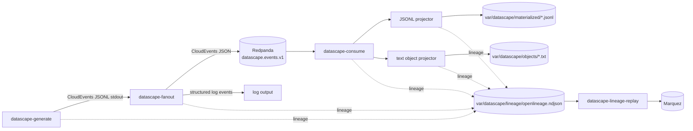

# Agent Guide

## Project Overview

This repository is a Go proof-of-concept for deterministic CloudEvents generation, Redpanda fan-out, bounded event consumption, local materialization, text object projection, and local OpenLineage tracking.

CloudEvents are business/domain events. OpenLineage events are separate operational metadata. Do not mutate CloudEvents with lineage fields, and do not treat every CloudEvent as an OpenLineage event.

## Architecture Diagram



Stable dataset identities matter for lineage stitching:

- generator output: `datascape-generate/stdout/events`
- fanout input: `datascape-generate/stdout/events`
- Redpanda boundary: `redpanda://localhost:19092/datascape.events.v1`
- log boundary: `log/stdout/events`
- JSONL output boundary: `file://var/datascape/materialized/tables/`
- text object boundary: `file://var/datascape/objects/documents/`

## Repository Shape

- `cmd/datascape-generate`: CLI wrapper for generation.
- `cmd/datascape-fanout`: CLI wrapper for fan-out.
- `cmd/datascape-consume`: CLI wrapper for bounded consumption.
- `internal/app/generate`: generation orchestration.
- `internal/app/fanout`: fan-out orchestration, bounded workers, batching, publisher lifecycle.
- `internal/app/consume`: event source reads and handler/projector dispatch.
- `internal/contracts/event`: `event.Fact`, CloudEvents factory, JSONL codec, run summaries.
- `internal/ports/generator`: generator interface.
- `internal/ports/fanout`: publisher and batch publisher interfaces.
- `internal/ports/consume`: event source, handler, and batch handler interfaces.
- `internal/adapters/generator`: generator registry and demo school generator.
- `internal/adapters/fanout`: `log`, `stdout`, `discard`, and `redpanda` publishers.
- `internal/adapters/consume`: handler registry, Redpanda source, JSONL projector, text object projector.
- `internal/lineage`: local OpenLineage-compatible event model, noop emitter, file emitter.
- `internal/adapters/lineage`: lineage emitter factory, Marquez HTTP emitter, NDJSON reader adapter.
- `internal/testkit/fakes`: shared fakes for tests.
- `contracts`: AsyncAPI, CloudEvents profile, JSON Schema, SQL DDL, and external standards profiles.
- `docs/standards/standards-register.md`: controlling standards register.
- `docs/architecture/adr`: architecture decisions.
- `scripts`: local demo automation used by `just`.

## Architecture Rules

- Keep command packages thin. They parse flags/env vars, construct adapters/services, emit process-level lineage, and return errors.
- Put orchestration in `internal/app`.
- Put external transport/storage details in adapters.
- Core app packages must depend on ports and contracts, not concrete Redpanda or file implementations.
- Preserve streaming and bounded behavior with contexts, channels, and explicit limits.
- Fan-out keeps one worker goroutine per output adapter.
- Batch-capable publishers and handlers implement explicit batch interfaces.
- Redpanda topic creation belongs in demo automation, not application code.
- Domain-specific event-to-table mapping belongs in projector adapters, not `cmd` or `internal/app`.
- JSONL and local text files are replaceable boundaries for later PostgreSQL and S3-style storage.

## Standards And Contracts

- Domain event envelope: CloudEvents v1.0 through `github.com/cloudevents/sdk-go/v2.Event`.
- Operational lineage metadata: OpenLineage-compatible local events under `internal/lineage`.
- Event payload schemas: `contracts/internal/events/payloads`.
- Event-channel documentation: `contracts/external/asyncapi/asyncapi.yaml`.
- Synthetic source database shape: `contracts/internal/sampledb`.
- Standards register: `docs/standards/standards-register.md`.

When changing event kinds or payload shape, update JSON Schema and AsyncAPI if applicable. Keep event type names versioned, such as `school.registered.v1`.

## Common Commands

Prefer `just` recipes:

```bash
just test
just deps
just up
just create-redpanda-topic
just generate
just run-demo
just run-redpanda-demo
just run-materialize-demo
just run-lineage-demo
just run-marquez-demo
just down
```

Useful direct commands:

```bash
go test ./...
go run ./cmd/datascape-generate --generator demo.school.v1
go run ./cmd/datascape-generate --generator demo.school.v1 | go run ./cmd/datascape-fanout --outputs log
DATASCAPE_CONSUME_MAX_EVENTS=102 go run ./cmd/datascape-consume
```

In this sandbox, set `GOCACHE=/tmp/datascape-go-build-cache` if the default Go cache is read-only.

## Configuration Notes

Important environment variables:

- `DATASCAPE_GENERATOR`: generator name, default `demo.school.v1`.
- `DATASCAPE_RUN_ID`: process run id.
- `DATASCAPE_SEED`: deterministic generator seed.
- `DATASCAPE_OUTPUTS`: fan-out outputs, such as `redpanda,log`.
- `DATASCAPE_REDPANDA_BROKERS`: default `localhost:19092`.
- `DATASCAPE_REDPANDA_TOPIC`: default `datascape.events.v1`.
- `DATASCAPE_REDPANDA_CONSUMER_GROUP`: consumer group id.
- `DATASCAPE_CONSUME_HANDLERS`: default `jsonl,objects`.
- `DATASCAPE_CONSUME_BATCH_SIZE`: bounded consumer batch size.
- `DATASCAPE_CONSUME_MAX_EVENTS`: bounded consumer event limit.
- `DATASCAPE_JSONL_DIR`: default `var/datascape/materialized`.
- `DATASCAPE_OBJECT_DIR`: default `var/datascape/objects`.
- `DATASCAPE_LINEAGE_OUTPUT`: `noop` or `file`.
- `DATASCAPE_LINEAGE_FILE`: default `var/datascape/lineage/openlineage.ndjson`.
- `DATASCAPE_LINEAGE_NAMESPACE`: default `datascape`.
- `DATASCAPE_LINEAGE_OUTPUT=marquez`: emit OpenLineage events to Marquez.
- `DATASCAPE_MARQUEZ_URL`: default `http://localhost:5000`.
- `DATASCAPE_MARQUEZ_TIMEOUT`: default `10s`.

Generator parameters use repeated `--param key=value` flags with simple scalar inference.

## Testing Guidance

- Run `go test ./...` for normal verification.
- Default tests must not require Redpanda, Docker, network services, Marquez, MinIO, PostgreSQL, Iceberg, or persistent filesystem state.
- Use fakes for sources, publishers, handlers, projectors, stores, and lineage emitters.
- Filesystem tests should use `t.TempDir()`.
- Integration tests, if added later, must use build tags.
- Add focused tests next to changed packages.

Coverage that has been valuable:

- bounded consumer exit behavior;
- batch dispatch for fan-out and consume;
- Redpanda adapter config and lifecycle using fakes;
- JSONL event-type routing;
- text artifact projection;
- lineage dataset naming and START/COMPLETE/FAIL emission;
- lineage stitching between fanout Redpanda output and consumer Redpanda input;
- tests that prove lineage emission does not mutate CloudEvents.

## Things That Worked

- Keeping commands as composition roots made it straightforward to add `datascape-consume` without leaking Redpanda logic into app services.
- Using `EventSource`, `EventHandler`, and `BatchEventHandler` kept the consumer independent from Redpanda and local files.
- Injecting stores/readers/emitters made tests fast and free of Docker or network dependencies.
- Using stable `lineage.Dataset` values on ports made fanout and consume lineage stitching explicit.
- Keeping Marquez as a lineage emitter adapter made it possible to render lineage without adding a CloudEvents-specific Marquez path.
- Adding `datascape-lineage-replay` made local NDJSON a durable handoff that can be replayed to Marquez without re-running generation/fan-out/consume.
- Treating JSONL and text artifacts as adapters preserved the path to PostgreSQL and S3-style replacements.
- Bounded demo consumption through `DATASCAPE_CONSUME_MAX_EVENTS` prevented hidden infinite loops.
- Running demos through scripts kept multi-step shell logic out of the `justfile` and made quoting easier.
- `GOCACHE=/tmp/datascape-go-build-cache go test ./...` works in restricted sandboxes where the home cache is read-only.

## Things To Avoid

- Do not put school-domain mapping in `cmd` packages or `internal/app`.
- Do not add OpenLineage fields to CloudEvents.
- Do not model each CloudEvent as an OpenLineage event.
- Do not add a separate Marquez consumer for CloudEvents; Marquez consumes OpenLineage run events through the lineage emitter/replay path.
- Do not let Marquez HTTP code leak into `internal/app` or command business logic.
- Do not make Redpanda topic creation part of publisher or consumer adapter behavior.
- Do not make default unit tests depend on Redpanda, Docker, network, Marquez, MinIO, PostgreSQL, or Iceberg.
- Do not introduce audit, PDF generation, Marquez, MinIO/S3, Iceberg, or PostgreSQL unless the task explicitly asks for that increment.
- Do not use run IDs, timestamps, temp dirs, or random values in lineage dataset namespace/name.
- Do not set both `kafka.Writer.Topic` and `kafka.Message.Topic` when using kafka-go topic-bound writers.
- Do not create hidden background loops that can keep commands from exiting.
- Do not write files outside configured output directories in projectors.

## Coding Conventions

- Use Go 1.23 module conventions.
- Keep packages small and names aligned with directories.
- Prefer existing local helper patterns over new abstractions.
- Wrap errors with operation context.
- Use structured logs with `log/slog`.
- Respect `context.Context` in streaming, publishing, consuming, and writing loops.
- Close channels only from the producer side.
- Avoid global mutable state except constants and adapter names.
- Exported Go identifiers should have doc comments.

## Adding A Generator

1. Implement `internal/ports/generator.Port`.
2. Emit `event.Fact` values with versioned `Kind`, meaningful `Subject`, and JSON-compatible `Data`.
3. Respect context cancellation and close the output channel from the generator.
4. Register the generator in `internal/adapters/generator/registry`.
5. Add tests for deterministic output, defaults, parameters, cancellation, and validation errors.
6. Update payload schemas and AsyncAPI entries when introducing event types.

## Adding A Fan-Out Adapter

1. Implement `internal/ports/fanout.Publisher`.
2. Implement `BatchPublisher` only when the transport benefits from batching.
3. Keep transport-specific configuration and client code inside the adapter package.
4. Register the adapter in `internal/adapters/fanout`.
5. Validate configuration during `Open`.
6. Add tests for registration, config defaults, lifecycle, publishing, batching, and errors.
7. Add stable lineage dataset naming in the command composition when the output should appear in lineage.

## Adding A Consumer Handler Or Projector

1. Implement `internal/ports/consume.EventHandler`.
2. Implement `BatchEventHandler` if batch writes are practical.
3. Return a stable `lineage.Dataset` from `Dataset()`.
4. Keep domain-specific mapping inside the adapter.
5. Register the handler in `internal/adapters/consume`.
6. Add fake-store tests that avoid real external services.

## Adding A Lineage Transport

1. Keep the public contract in `internal/lineage`.
2. Add concrete transport code under `internal/adapters/lineage`.
3. Register the transport in `internal/adapters/lineage.NewEmitter`.
4. Use fake HTTP clients or emitters in tests.
5. Keep CloudEvents and OpenLineage events separate.

## Current Non-Goals

- No audit event layer.
- No PDF generation.
- No Marquez dependency.
- No MinIO/S3 dependency.
- No Iceberg tables or catalog.
- No PostgreSQL materializer.
- No custom platform HTTP API.
