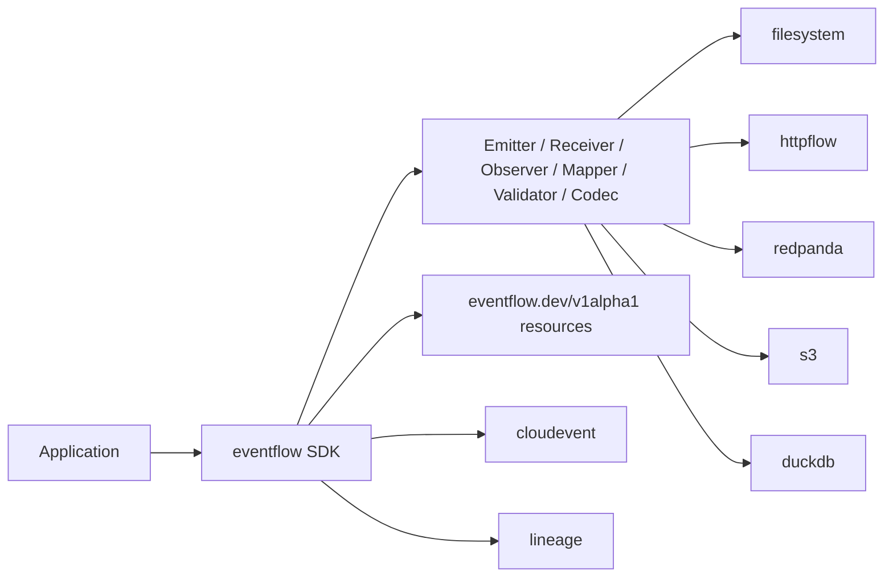
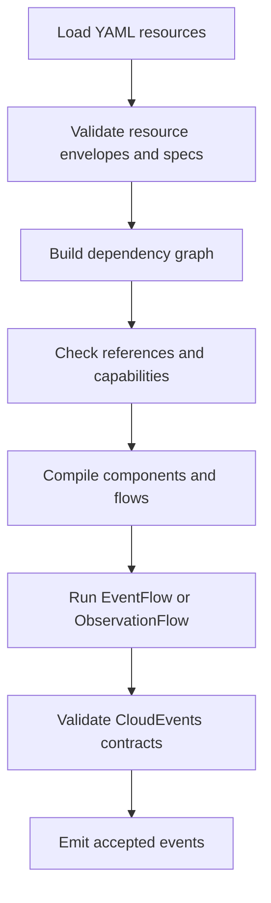

# Architecture

Eventflow is organized as a public Go SDK plus a declarative resource runtime.
The SDK owns ports, validation, codecs, lineage helpers, importable adapters,
and resource compilation. Commands load resource YAML, compile it, and run the
resulting flow.

The SDK does not provision infrastructure, own credentials, or implement a
Datascape control plane. Redpanda topics, S3 buckets, DuckDB files, and Marquez
instances are attached resources.
