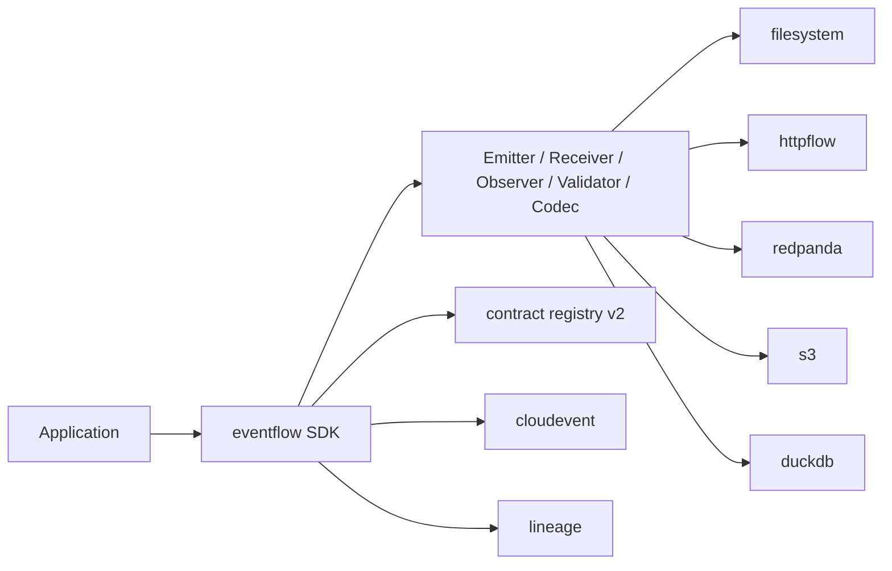
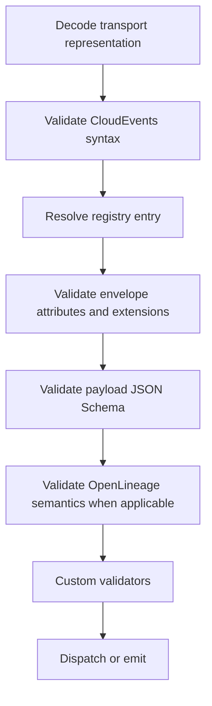

# Architecture

Eventflow is now organized as a public Go SDK plus thin runtime commands.
The SDK owns ports, validation, codecs, lineage helpers, and importable
adapters. Commands compose those pieces and keep runtime policy in flags and
`EVENTFLOW_*` environment variables.

The SDK does not provision infrastructure, own credentials, or implement a
Datascape control plane. Redpanda topics, S3 buckets, DuckDB files, and Marquez
instances are attached resources.

