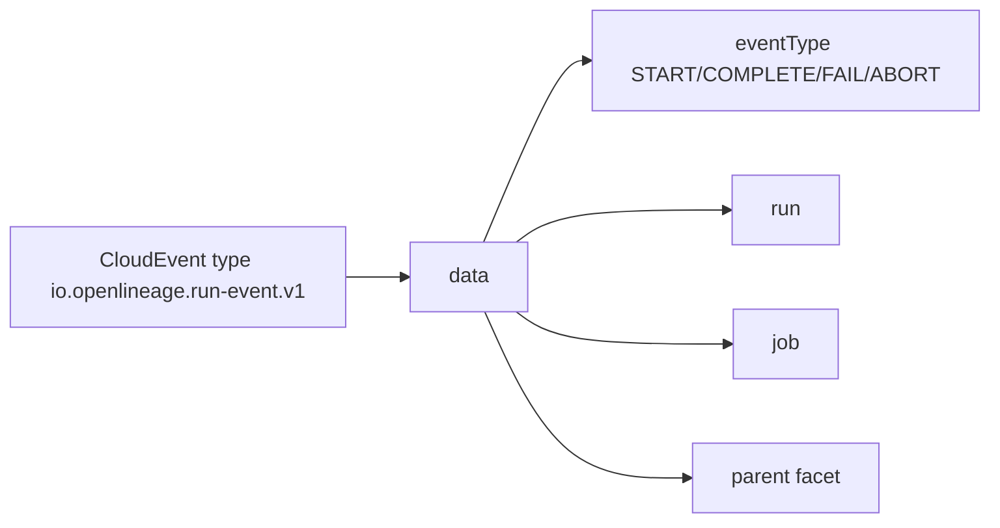

# OpenLineage

Eventflow transports OpenLineage through one CloudEvents type:
`io.openlineage.run-event.v1`. The lifecycle remains in
`data.eventType`: `START`, `COMPLETE`, `FAIL`, or `ABORT`.

Raw OpenLineage HTTP emission remains available for native OpenLineage
endpoints such as Marquez.

